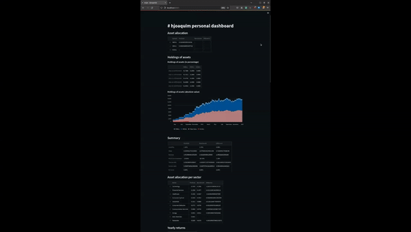

# OpenBB Creaton

## Description

This is a little project developed in the scope of the Creative Hackathon (Creaton) by OpenBB.

Here I've developed a super simple application that leverages the [OpenBB SDK](https://docs.openbb.co/sdk) and present the results using [Streamlit](https://streamlit.io/).



## Deploy

1. Create a `.env` file in the root of the repository with the following content:

```
DASHBOARD_TITLE="your_dashboard_title"
PORTFOLIO_FILE="path_to_your_portfolio_file"
```

2. Install the dependencies:

``
poetry install
``

3. Get the dashboard running:

``
streamlit run openbb_creaton/main.py
``
